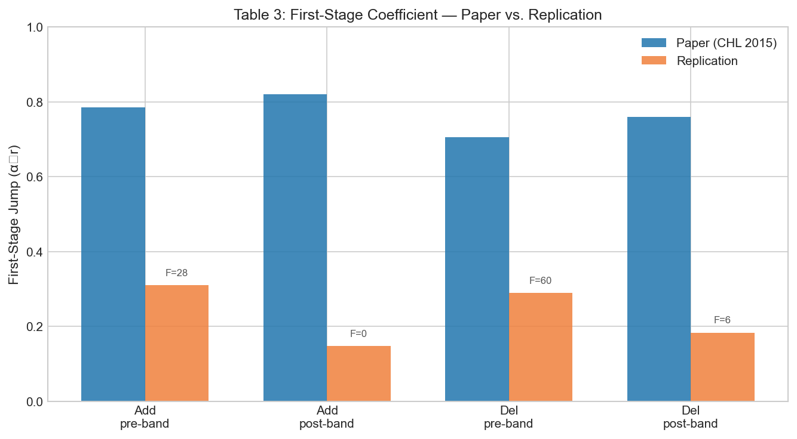
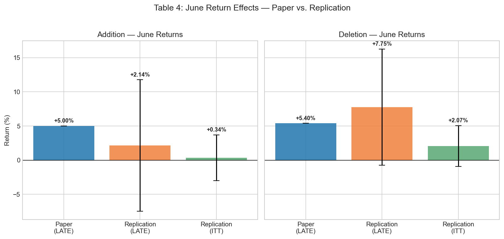
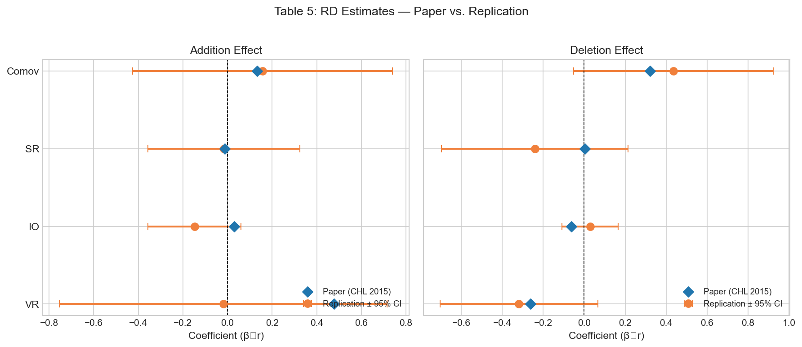
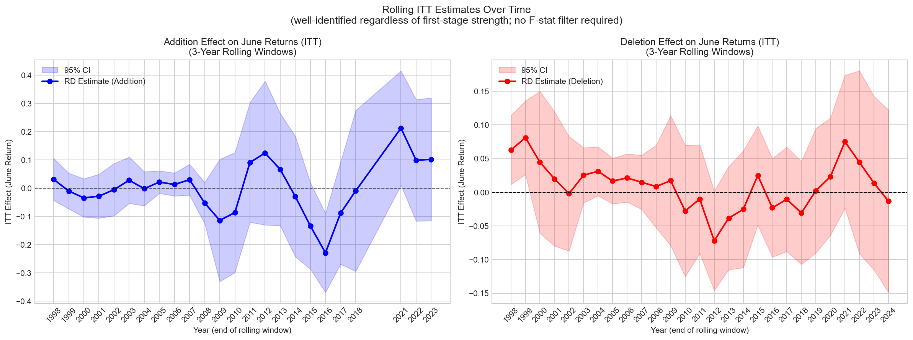

# Regression Discontinuity and the Price Effects of Stock Market Indexing

## Replication and Extension

This repository contains a replication of the main results from Chang, Hong, and Liskovich (2015) for [ECON 481: Economics Data Science](https://catalog.registrar.washington.edu/course/ECON/481) at the University of Washington.

> Chang, Y.-C., Hong, H., & Liskovich, I. (2015). [Regression Discontinuity and the Price Effects of Stock Market Indexing](https://doi.org/10.1093/rfs/hhu041). *The Review of Financial Studies*, 28(1), 212–246.

Chang et al. (2015) use a **fuzzy regression discontinuity (RD) design** to estimate the causal price effects of stock market indexing. The Russell 1000 and Russell 2000 indexes comprise the first 1,000 and next 2,000 largest U.S. firms ranked by end-of-May market capitalization. Because the indexes are value-weighted, stocks just below the rank-1000 cutoff receive significantly higher index weight — and thus more passive buying pressure — than stocks just above. Exploiting this discontinuity over 1996–2012, the authors find symmetric addition and deletion effects of approximately 5% in June returns, estimate a price elasticity of demand around −1.5, and document that demand curves have become more elastic over time.

We extend the analysis to **2015–2024** to test whether the index premium has changed as passive investing's market share tripled (~15% to ~50%).

## Key Results

### Replication (1996–2012)

**Table 3 — First Stage**: Our fuzzy first stage recovers a significant discontinuity in Russell 2000 membership at the rank-1000 cutoff, though attenuated relative to the paper due to mixed-basis ranking noise (see [Limitations](#limitations)).

| Sample | Paper alpha | Paper F | Replication alpha | Replication F |
|--------|------------|---------|-------------------|---------------|
| Addition (pre-banding) | 0.785 | 1,876 | 0.311 | 28 |
| Deletion (pre-banding) | 0.705 | 1,799 | 0.289 | 60 |



**Table 4 — June Returns (Fuzzy 2SLS)**: The deletion effect (+7.75%) matches the paper's direction and magnitude. The addition effect is positive but insignificant, reflecting weak-instrument amplification.

| Effect | Paper LATE | Replication LATE | Replication ITT |
|--------|-----------|-----------------|-----------------|
| Addition (June) | +5.0% (t=2.65) | +2.14% (t=0.44) | +0.34% (t=0.20) |
| Deletion (June) | +5.4% (t=3.00) | +7.75% (t=1.79) | +2.07% (t=1.36) |



**Table 5 — Other Outcomes (VR, IO, SR, Comovement)**: Direction matches on 5 of 8 estimates. VR deletion and comovement deletion are close to significance.



**Table 6 — Validity Tests**: 1 of 16 pre-determined variable tests rejects at 5% (EPS-deletion), consistent with chance under the null.

### Extension (2015–2024)

The fuzzy 2SLS is structurally underpowered for the extension period (post-banding F ≈ 0), so we use **reduced-form (ITT) estimates** — regressing returns directly on the instrument without a first stage (Angrist & Pischke, 2009). ITT estimates are well-identified regardless of instrument strength.

| Period | Addition ITT | t-stat | Deletion ITT | t-stat |
|--------|-------------|--------|-------------|--------|
| Pre-banding (1996–2006) | +0.35% | +0.20 | **+2.88%** | **+1.69** |
| Post-banding (2007–2012) | +0.40% | +0.05 | −2.63% | −0.83 |
| Extension (2015–2024) | +1.24% | +0.17 | +0.52% | +0.19 |

Full-sample ITT time trends show a small negative slope (−0.11%/yr addition, −0.06%/yr deletion), directionally consistent with the **arbitrage efficiency hypothesis** but not statistically significant.



**Bottom line**: The index premium has **not grown** despite passive AUM tripling — inconsistent with the strong form of the passive distortion hypothesis. The evidence is directionally consistent with arbitrage efficiency but lacks statistical power to reject no-trend.

## Methodology

### Fuzzy RD Design

Every June, Russell reconstitutes its indexes by ranking all eligible U.S. stocks by end-of-May market capitalization. Ranks 1–1000 go to the Russell 1000; ranks 1001–3000 go to the Russell 2000. Because the Russell 2000 is value-weighted, stocks just below rank 1000 receive ~10x higher index weight than stocks just above, creating a discontinuity in passive buying pressure.

The paper exploits this using a **fuzzy RD** because predicted rankings (from CRSP/Compustat) don't perfectly match actual Russell assignments (which use proprietary float-adjusted market caps). Our specification:

- **First stage**: D_it = f(rank) + tau * [alpha_0r + alpha_1r * (rank - cutoff)] + year FE + epsilon
- **Second stage**: Y_it = f(rank) + D_hat * [beta_0r + beta_1r * (rank - cutoff)] + year FE + nu
- **Reduced form (ITT)**: Y_it = f(rank) + tau * [gamma_0r + gamma_1r * (rank - cutoff)] + year FE + nu

Where D = actual Russell 2000 membership (from Bloomberg constituent lists), tau = indicator for predicted rank > cutoff (the instrument), and beta_0r is the LATE of interest.

### Post-2007 Banding

Starting in 2007, Russell implemented a banding policy to reduce index turnover. A stock only switches indexes if its reverse cumulative market cap deviates by more than 2.5 percentage points from the cutoff. This creates wider effective treatment windows (addition cutoff at rank ~1,250–1,545; deletion cutoff at rank ~738–823) and dramatically reduces the number of switchers.

### Robustness Checks

The notebook includes: sharp vs. fuzzy comparison, first-stage visualization, Benjamini-Hochberg FDR correction, donut hole sensitivity (k=0/5/10), IO-tercile heterogeneity, HC1 vs. year-clustered standard errors, placebo cutoff tests, and pre-reconstitution validity checks.

## Figures

| Figure | Description |
|--------|-------------|
| [Figure 1](files/figure1_market_cap_continuity.png) | Market cap continuity at the cutoff |
| [First Stage (Addition)](files/figure_fs_addition.png) | P(D=1 \| rank) binned scatter — addition sample |
| [First Stage (Deletion)](files/figure_fs_deletion.png) | P(D=1 \| rank) binned scatter — deletion sample |
| [Figure 4](files/figure4_addition_bw5.png) | RD discontinuity plots for returns |
| [Rolling ITT](files/figure_itt_rolling.png) | Rolling 3-year ITT estimates, 1998–2024 |

## Project Structure

```
├── auxiliary/              # Helper functions
│   ├── data_processing.py  # Data loading, merging, ranking, banding, outcome variables
│   ├── estimation.py       # Fuzzy RD 2SLS, ITT reduced-form, time trends
│   └── plotting.py         # RD plots, binned scatter, time trend plots
├── data/                   # Raw datasets (not included — see Data Sources)
├── files/                  # Output figures
├── tests/                  # Unit tests (44 tests)
├── project.ipynb           # Main analysis notebook (pre-executed with outputs)
├── environment.yml         # Conda environment specification
└── pyproject.toml          # Project configuration and linting
```

## Viewing Results

The notebook [`project.ipynb`](project.ipynb) is **pre-executed with all outputs embedded** — you can view the full analysis directly on GitHub without running any code. It contains 54 cells covering:

1. Data pipeline and ranking construction
2. First-stage regressions (Table 3)
3. Returns fuzzy RD and ITT (Table 4)
4. Volume ratio, institutional ownership, short interest, and comovement (Table 5)
5. Validity tests (Table 6)
6. Robustness checks (Groups B and C)
7. Extension analysis with ITT time trends and rolling estimates

## Reproducing the Analysis

To re-run the analysis locally, you need access to the proprietary datasets listed below. Clone the repository and set up the environment:

```bash
conda env create -f environment.yml
conda activate russell-rd
jupyter lab
```

Place the required data files in `data/` and run `project.ipynb`.

## Data Sources

All data is accessed through [WRDS](https://wrds-www.wharton.upenn.edu/) and Bloomberg Terminal. These are proprietary datasets and are not included in the repository.

| File | Source | Contents |
|------|--------|----------|
| `crsp_monthly.csv.gz` | WRDS CRSP | Monthly stock prices, returns, shares outstanding, NCUSIP |
| `crsp_daily.csv.gz` | WRDS CRSP | Daily stock returns for comovement estimation |
| `compustat_quarterly.csv.gz` | WRDS Compustat | Quarterly shares outstanding (CSHOQ), earnings report dates |
| `compustat_annual.csv.gz` | WRDS Compustat | Annual firm fundamentals for validity tests |
| `compustat_short_interest.csv.gz` | WRDS Compustat | Semi-monthly short interest (2006–2024) |
| `crsp_compustat_link.csv.gz` | WRDS CCM | CRSP-Compustat linking table |
| `russell_constituents_clean.csv` | Bloomberg Terminal | Russell 1000/2000 constituent lists (1996–2024) |
| `russell_float_shares.csv` | Bloomberg Terminal | Float-adjusted shares (EQY_FLOAT, 2004–2024) |
| `thomson_13f.csv.gz` | WRDS LSEG/Thomson | Institutional ownership from 13F filings |
| `russell2000_daily.csv.gz` | yfinance (^RUT) | Daily Russell 2000 index returns |

## Limitations

1. **Weak first stage**: Russell uses proprietary float-adjusted market caps for ranking. We use Bloomberg float shares for Russell 3000 constituents (~3,000/year), but the remaining eligible stocks near the cutoff use total shares from CRSP/Compustat. This mixed-basis ranking creates irreducible noise, attenuating the first stage (alpha ≈ 0.31 vs. paper's 0.785).

2. **Post-banding sample sizes**: Russell's banding policy (2007+) dramatically reduces the number of index switchers near the cutoff. Post-banding addition samples have a median of ~13 firm-years per year, making 2SLS estimates unreliable (F ≈ 0).

3. **Short interest coverage**: Compustat short interest data begins in 2006, while the paper used NYSE/AMEX exchange-level data back to 1993.

## References

- Chang, Y.-C., Hong, H., & Liskovich, I. (2015). Regression Discontinuity and the Price Effects of Stock Market Indexing. *The Review of Financial Studies*, 28(1), 212–246.
- Angrist, J. D., & Pischke, J.-S. (2009). *Mostly Harmless Econometrics*. Princeton University Press.
- Lee, D. S., & Lemieux, T. (2010). Regression Discontinuity Designs in Economics. *Journal of Economic Literature*, 48(2), 281–355.
- Stock, J. H., & Yogo, M. (2005). Testing for Weak Instruments in Linear IV Regression. In *Identification and Inference for Econometric Models*. Cambridge University Press.
